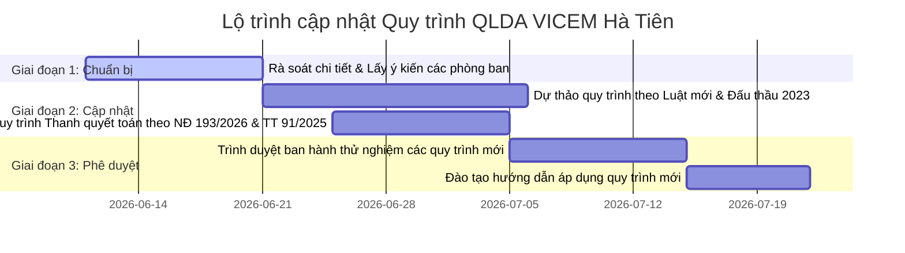

# Báo Cáo Rà Soát Căn Cứ Pháp Lý & Văn Bản Thay Thế (Cập nhật 06/2026)

> **Dự án:** Tư vấn chuẩn hóa Quy trình QLDA — Ban QLDA VICEM Hà Tiên
> **Đơn vị thực hiện:** CIC — HĐ 013/CSS_CIC_2026
> **Ngày lập:** 11/06/2026
> **Trạng thái pháp lý:** Đối chiếu dữ liệu thực tế tại hệ thống Thư viện Pháp luật (`thuvienphapluat.vn`) tính đến ngày **11/06/2026** (trước thời điểm Luật Xây dựng mới có hiệu lực 20 ngày).

---

## 1. Tóm tắt kết quả rà soát chính

Sau khi khảo sát **Quy trình 18 (Quyết toán dự án hoàn thành)** và phân tích sâu cơ cấu vốn của VICEM Hà Tiên, hầu hết các căn cứ pháp lý cốt lõi trong **8 quy trình hiện hành** của Ban QLDA VICEM Hà Tiên đều đã lỗi thời, hết hiệu lực hoặc chuẩn bị hết hiệu lực hoàn toàn trước ngày **01/07/2026**. Sự thay đổi lớn nhất đến từ:
1. **Luật Xây dựng số 135/2025/QH15** sẽ chính thức có hiệu lực từ **01/07/2026**, thay thế hoàn toàn Luật Xây dựng 2014 và Luật sửa đổi 2020.
2. **Hệ thống Nghị định mới** hướng dẫn Luật Xây dựng 2025 đang được Bộ Xây dựng khẩn trương hoàn thiện dưới dạng dự thảo để ban hành đồng bộ trước ngày 01/07/2026.
3. Các quy định về **Lựa chọn nhà thầu, Hợp đồng, Thanh quyết toán, Lưu trữ điện tử** đều đã có văn bản thay thế chính thức (Luật Đấu thầu 2023, NĐ 24/2024/NĐ-CP, NĐ 175/2024/NĐ-CP, NĐ 254/2025/NĐ-CP, NĐ 193/2026/NĐ-CP, TT 06/2024/TT-BKHĐT, TT 05/2025/TT-BNV, TT 91/2025/TT-BTC).

> [!IMPORTANT]
> **Khuyến nghị khẩn cấp:** Ban QLDA VICEM Hà Tiên cần tiến hành hiệu chỉnh, cập nhật toàn diện bộ quy trình nội bộ trước ngày **01/07/2026** để tránh các rủi ro pháp lý khi thanh kiểm tra hoặc phê duyệt dự án mới.

---

## 2. Bảng đối chiếu chi tiết căn cứ pháp lý hiện hành & Văn bản thay thế

Dưới đây là bảng tổng hợp rà soát toàn bộ các văn bản pháp lý được viện dẫn trong 8 quy trình hiện hành (bao gồm cả QT 18), kèm theo trạng thái hiệu lực thực tế và văn bản thay thế/dự thảo tương ứng:

| # | Văn bản trong quy trình hiện hành | Trạng thái hiệu lực hiện tại (11/06/2026) | Văn bản thay thế (Đã ban hành hoặc Dự thảo) | Quy trình bị ảnh hưởng | Ghi chú & Tác động thực tế |
|---|----------------------------------|-------------------------------------------|--------------------------------------------|-------------------------|---------------------------|
| **1** | **Luật Xây dựng 50/2014/QH13** và sửa đổi **62/2020/QH14** | **Sắp hết hiệu lực** (Hết hiệu lực từ 01/07/2026) | **Luật Xây dựng số 135/2025/QH15** (Có hiệu lực từ 01/07/2026) | QT 34, 35, 36, 37, 16, 17, 18 | Thay đổi cơ bản về phân cấp phê duyệt dự án, chuyển từ tiền kiểm sang hậu kiểm, mở rộng miễn GPXD, thúc đẩy BIM/CDE và chuyển đổi số. |
| **2** | **Luật Đấu thầu 22/2023/QH15** | **Đang có hiệu lực** (Từ 01/01/2024) | *Giữ nguyên* (Đã thay thế Luật 43/2013) | QT 35 | Cần bổ sung các văn bản hướng dẫn chi tiết của Luật 2023 (như NĐ 24/2024/NĐ-CP, TT 06/2024/TT-BKHĐT). |
| **3** | **NĐ 59/2015/NĐ-CP** (QLDA cũ) | **Hết hiệu lực toàn bộ** | **Nghị định 175/2024/NĐ-CP** / **Dự thảo Nghị định QLDA mới** dưới Luật XD 2025 | QT 18 | QT 18 vẫn viện dẫn NĐ 59/2015 vốn đã hết hiệu lực từ lâu. Cần cập nhật sang NĐ 175/2024 và dự thảo Nghị định QLDA mới. |
| **4** | **NĐ 15/2021/NĐ-CP** (QLDA ĐTXD) | **Hết hiệu lực toàn bộ** (Từ 30/12/2024) | **Nghị định 175/2024/NĐ-CP** (Đã ban hành) / **Dự thảo Nghị định QLDA mới** (Thay thế NĐ 175 từ 01/07/2026) | QT 34, 36, 37, 16 | Nghị định 175/2024/NĐ-CP đã thay thế NĐ 15. Tuy nhiên, dưới Luật XD 2025, Bộ Xây dựng đang hoàn thiện dự thảo Nghị định mới về Quản lý dự án để ban hành kịp 01/07/2026. |
| **5** | **NĐ 10/2021/NĐ-CP** (QLCP ĐTXD) | **Còn hiệu lực** (Đã sửa đổi bởi NĐ 35/2023, 175/2024, 14/2026) | **Dự thảo Nghị định mới về Quản lý chi phí** (Hiệu lực dự kiến từ 01/07/2026) | QT 34, 36, 37 | Bộ Xây dựng đang lấy ý kiến dự thảo Nghị định thay thế NĐ 10/2021/NĐ-CP để đồng bộ với Luật Xây dựng 2025. |
| **6** | **NĐ 06/2021/NĐ-CP** (QLCL & Bảo trì) | **Còn hiệu lực** (Đã sửa đổi bởi NĐ 35/2023, 175/2024, 14/2026) | **Dự thảo Nghị định mới về QLCL & Bảo trì** (Hiệu lực dự kiến từ 01/07/2026) | QT 34, 35, 36, 37, 16 | Dự thảo mới bổ sung quy định chặt chẽ về ATLĐ, BVMT và đánh giá an toàn công trình trong quá trình khai thác. |
| **7** | **NĐ 37/2015/NĐ-CP** & **50/2021/NĐ-CP** (Hợp đồng XD) | **Còn hiệu lực** (Đã sửa đổi bởi NĐ 35/2023, hợp nhất tại 07/VBHN-BXD) | **Dự thảo Nghị định mới về Hợp đồng xây dựng** (Hiệu lực dự kiến từ 01/07/2026) | QT 35, 17 | Thay đổi lớn về phương thức thanh toán, tạm ứng, điều chỉnh giá hợp đồng và xử lý tranh chấp theo định hướng Luật mới. |
| **8** | **NĐ 99/2021/NĐ-CP** (Thanh quyết toán vốn ĐTC) | **Hết hiệu lực toàn bộ** (Từ 26/09/2025) | **Nghị định 254/2025/NĐ-CP** (Thanh toán vốn) & **Nghị định 193/2026/NĐ-CP** (Quyết toán vốn - Hiệu lực 01/07/2026) | QT 17, 18 | Tách biệt rõ ràng quy trình thanh toán định kỳ (theo NĐ 254/2025) và quyết toán vốn đầu tư hoàn thành (theo NĐ 193/2026). |
| **9** | **TT 10/2015/TT-BKHĐT** (Kế hoạch LCNT) | **Hết hiệu lực toàn bộ** (Từ 15/02/2024) | **Thông tư 06/2024/TT-BKHĐT** (Đã ban hành) | QT 35 | Quy định chi tiết các mẫu tờ trình, phê duyệt KHLCNT trên Hệ thống mạng đấu thầu quốc gia mới (e-GP). |
| **10** | **TT 02/2019/TT-BNV** (Lưu trữ điện tử) | **Hết hiệu lực toàn bộ** (Từ 01/07/2025) | **Thông tư 05/2025/TT-BNV** (Đã ban hành) | QT 161 | Chuẩn hóa toàn bộ nghiệp vụ số hóa, định dạng file tài liệu đầu vào và lưu trữ số trong ban QLDA. |
| **11** | **TT 67/2015/TT-BTC** (Chuẩn mực kiểm toán quyết toán) | **Còn hiệu lực** | *Giữ nguyên* | QT 18 | Cơ sở pháp lý cho công tác thuê và thực hiện kiểm toán độc lập đối với báo cáo quyết toán dự án hoàn thành. |
| **12** | **TT 10/2020/TT-BTC** (Quyết toán dự án vốn nhà nước) | **Hết hiệu lực toàn bộ** (Từ 01/01/2022) | **Nghị định 193/2026/NĐ-CP** & **Thông tư 91/2025/TT-BTC** | QT 18 | QT 18 vẫn viện dẫn TT 10/2020 vốn đã hết hiệu lực từ trước khi ban hành quy trình. Cần thay bằng Nghị định 193/2026 và Thông tư 91/2025. |
| **13** | **TT 96/2021/TT-BTC** (Hệ thống mẫu biểu quyết toán) | **Hết hiệu lực toàn bộ** (Từ 26/09/2025) | **Thông tư 91/2025/TT-BTC** (Đã ban hành) | QT 18 | Thay đổi toàn bộ các mẫu biểu báo cáo quyết toán dự án hoàn thành (từ 01/QTDA đến 12/QTDA) theo quy định mới nhất của Bộ Tài chính. |
| **14** | **07/VBHN-BXD** (VB hợp nhất Hợp đồng XD) | **Sắp hết hiệu lực** | Sẽ hết vai trò khi Nghị định mới về Hợp đồng XD dưới Luật XD 2025 có hiệu lực. | QT 17 | Tạm thời áp dụng nhưng cần chuẩn bị chuyển sang Nghị định thay thế hoàn toàn. |

---

## 3. Ma trận tham chiếu chéo văn bản pháp lý (Cập nhật 8 Quy trình)

Dưới đây là ma trận thể hiện tần suất sử dụng và mối liên hệ giữa các văn bản pháp lý đối với toàn bộ 8 quy trình quản lý dự án của VICEM Hà Tiên:

| Văn bản | QT34 | QT35 | QT36 | QT37 | QT16 | QT17 | QT161 | QT18 | Tổng |
|---------|:----:|:----:|:----:|:----:|:----:|:----:|:-----:|:----:|:----:|
| Luật XD 50/2014 | ✓ | ✓ | ✓ | ✓ | ✓ | ✓ | | ✓ | **7** |
| Luật sửa đổi 62/2020 | ✓ | ✓ | ✓ | ✓ | ✓ | ✓ | | ✓ | **7** |
| Luật Đấu thầu 22/2023 | | ✓ | | | | | | | **1** |
| NĐ 59/2015 (QLDA cũ) | | | | | | | | ✓ | **1** |
| NĐ 15/2021 (QLDA) | ✓ | | ✓ | ✓ | ✓ | | | | **4** |
| NĐ 10/2021 (QLCP) | ✓ | ✓ | ✓ | ✓ | | | | | **4** |
| NĐ 06/2021 (QLCL) | ✓ | ✓ | ✓ | ✓ | ✓ | | | | **5** |
| NĐ 37/2015 (HĐ XD) | | ✓ | | | | ✓ | | | **2** |
| NĐ 50/2021 (sửa NĐ 37) | | ✓ | | | | ✓ | | | **2** |
| NĐ 99/2021 (QT vốn ĐTC) | | | | | | ✓ | | ✓ | **2** |
| NĐ 35/2023 (sửa đổi) | | | | | ✓ | ✓ | | | **2** |
| TT 10/2015 (KHLCNT) | | ✓ | | | | | | | **1** |
| TT 02/2019 (lưu trữ ĐT) | | | | | | | ✓ | | **1** |
| TT 67/2015 (Kiểm toán QT) | | | | | | | | ✓ | **1** |
| TT 10/2020 (QT vốn cũ) | | | | | | | | ✓ | **1** |
| TT 96/2021 (Mẫu biểu cũ) | | | | | | | | ✓ | **1** |
| 07/VBHN-BXD (HĐ XD) | | | | | | ✓ | | | **1** |
| QĐ HĐQT 04/10/2018 | ✓ | | ✓ | ✓ | | | ✓ | ✓ | **5** |
| QĐ VICEM 1428/2022 (Quy chế cũ) | | | | | | | | ✓ | **1** |
| QĐ VICEM 2539/2023 (Quy chế mới) | ✓ | | ✓ | | | | | | **2** |
| QĐ HĐQT 02/07/2023 | ✓ | ✓ | ✓ | ✓ | ✓ | ✓ | | ✓ | **7** |
| QĐ HT1 152/2021 | ✓ | | ✓ | ✓ | | | ✓ | | **4** |
| QĐ HT1 1460/2020 | | | | | | ✓ | | | **1** |
| QĐ HT1 3178/2023 | | | | | | | ✓ | | **1** |

---

## 4. Xác định tính chất nguồn vốn của VICEM Hà Tiên & Phạm vi áp dụng

Để làm chuẩn các tài liệu quy trình, việc xác định chính xác tính chất nguồn vốn đầu tư của doanh nghiệp là điều kiện tiên quyết.

### 4.1. Cơ cấu vốn và loại hình doanh nghiệp
* **Tổng công ty Công nghiệp Xi măng Việt Nam (VICEM)** (doanh nghiệp Nhà nước nắm giữ 100% vốn điều lệ) đang sở hữu **79,69%** vốn điều lệ tại Công ty Cổ phần Xi măng VICEM Hà Tiên.
* Theo Khoản 11 Điều 4 Luật Doanh nghiệp 2020, VICEM Hà Tiên được định nghĩa là **Doanh nghiệp do doanh nghiệp Nhà nước nắm giữ trên 50% vốn điều lệ (Doanh nghiệp F2)**.

### 4.2. Phân loại nguồn vốn dự án đầu tư của VICEM Hà Tiên
Dưới góc độ pháp luật đầu tư, xây dựng và đấu thầu, nguồn vốn tích lũy từ hoạt động kinh doanh hoặc vốn vay thương mại của VICEM Hà Tiên dùng cho các dự án đầu tư phát triển được định nghĩa như sau:
1. **Theo Luật Xây dựng (2014/2020/2025):** Được phân loại là **Vốn nhà nước ngoài đầu tư công**. Nguồn vốn này chịu sự điều chỉnh của Luật Xây dựng và các Nghị định quản lý dự án, chi phí, chất lượng tương tự như các cơ quan nhà nước nhưng có tính tự chủ cao hơn. Nó **không phải** là "Vốn đầu tư công" (vốn ngân sách nhà nước, trái phiếu...) thuộc phạm vi điều chỉnh của Luật Đầu tư công 2019.
2. **Theo Luật Đấu thầu 22/2023/QH15:** Thuộc phạm vi điều chỉnh tại Điểm c Khoản 1 Điều 2: *"Dự án đầu tư của doanh nghiệp có vốn của doanh nghiệp nhà nước chiếm trên 50% vốn điều lệ"*.

### 4.3. Nguyên tắc áp dụng các văn bản pháp luật để làm chuẩn quy trình

| Lĩnh vực quản lý | Văn bản pháp luật áp dụng làm chuẩn | Tính chất áp dụng đối với VICEM Hà Tiên | Nguyên tắc áp dụng trong quy trình nội bộ |
|---|---|---|---|
| **Lựa chọn nhà thầu (Đấu thầu)** | Luật Đấu thầu 2023, Nghị định 24/2024/NĐ-CP, Thông tư 06/2024/TT-BKHĐT | **BẮT BUỘC ÁP DỤNG** | *Áp dụng bắt buộc không ngoại lệ.* Toàn bộ quy trình `QT 35` phải tuân thủ nghiêm ngặt các trình tự lập, duyệt kế hoạch lựa chọn nhà thầu, HSMT, đăng tải thông tin trực tuyến e-GP theo Luật mới. |
| **Quản lý dự án, chi phí, chất lượng** | Luật Xây dựng 2025 (135/2025), NĐ 175/2024, dự thảo các Nghị định mới dưới Luật 2025 | **BẮT BUỘC ÁP DỤNG** (Cho nhóm vốn nhà nước ngoài đầu tư công) | Quy trình `QT 34, 36, 37, 16` áp dụng các thủ tục thẩm định BCNCKT, phê duyệt thiết kế, cấp phép xây dựng theo đúng phân cấp đối với vốn nhà nước ngoài đầu tư công. Bổ sung các chuẩn mới về BIM/CDE. |
| **Thanh toán, Quyết toán vốn** | Nghị định 254/2025/NĐ-CP, Nghị định 193/2026/NĐ-CP, Thông tư 91/2025/TT-BTC | **KHUYẾN KHÍCH / ÁP DỤNG TƯƠNG ĐƯƠNG** | Các nghị định này chỉ bắt buộc với vốn đầu tư công. Tuy nhiên, do đặc thù 79,69% vốn thuộc DNNN và thường xuyên chịu kiểm toán, thanh tra tài chính, **VICEM Hà Tiên chủ trương áp dụng tương đương làm chuẩn** cho quy trình `QT 17` và `QT 18` nhằm bảo toàn vốn nhà nước và tối đa hóa tính minh bạch. |
| **Công tác văn thư & lưu trữ số** | Luật Lưu trữ, Thông tư 05/2025/TT-BNV | **BẮT BUỘC ÁP DỤNG** | Quy trình số hóa hồ sơ Ban QLDA `QT 161` tuân thủ nghiệp vụ định dạng và số hóa lưu trữ số của Bộ Nội vụ. |

---

## 5. Phân tích chuyên sâu & Đánh giá tác động đối với Quy trình 18 (Quyết toán dự án hoàn thành)

Quy trình quyết toán dự án hoàn thành (QT 18) là quy trình cuối cùng và cực kỳ nhạy cảm trong công tác đầu tư xây dựng. Qua khảo sát hồ sơ QT 18 thực tế của VICEM Hà Tiên, chúng tôi phát hiện một số điểm mâu thunh lớn cần hiệu chỉnh gấp:

### 5.1. Sự lỗi thời của hệ thống văn bản quy chiếu trong QT 18
* **Nghị định 59/2015/NĐ-CP** và **Thông tư 10/2020/TT-BTC** được viện dẫn trong QT 18 đều đã hết hiệu lực từ lâu. Đặc biệt, TT 10/2020 đã hết hiệu lực từ 01/01/2022 (trước cả thời điểm ban hành quy trình vào tháng 01/2024).
* **Nghị định 99/2021/NĐ-CP** và **Thông tư 96/2021/TT-BTC** là xương sống pháp lý của quy trình này hiện cũng đã hết hiệu lực và được thay thế bằng **Nghị định 193/2026/NĐ-CP** và **Thông tư 91/2025/TT-BTC**.
* **Đề xuất:** Cập nhật toàn bộ phần căn cứ pháp lý của QT 18 sang: *Luật Xây dựng 135/2025/QH15, Nghị định 193/2026/NĐ-CP, Nghị định 254/2025/NĐ-CP, Thông tư 91/2025/TT-BTC và Thông tư 67/2015/TT-BTC*.

### 5.2. Cập nhật hệ thống Mẫu biểu báo cáo quyết toán (Sự thay đổi từ TT 96 sang TT 91)
QT 18 hiện tại đang bắt buộc áp dụng các biểu mẫu từ `BM114-22-01` đến `BM114-22-10` tương ứng với các mẫu biểu cũ của Thông tư 96/2021/TT-BTC.
Khi chuyển sang **Thông tư 91/2025/TT-BTC**, Ban QLDA cần thiết kế lại các biểu mẫu nội bộ để đồng bộ:
* **Báo cáo tổng hợp quyết toán:** Cập nhật cấu trúc phân loại chi phí thiết bị, chi phí quản lý dự án, chi phí tư vấn theo quy định của Thông tư 91/2025.
* **Bảng đối chiếu cấp vốn & công nợ:** Sử dụng mẫu đối chiếu và công nợ mới (tương ứng với Mẫu 07/QTDA và Mẫu 12/QTDA mới của Thông tư 91).

### 5.3. Rà soát thời gian thực hiện quyết toán (Mục 5.12)
QT 18 quy định thời gian tối đa để thực hiện lập hồ sơ, thẩm tra và phê duyệt quyết toán nội bộ rất chặt chẽ (Nhóm A: 6 tháng, Nhóm B: ~4.5 tháng, Nhóm C: ~3 tháng).
* **Đánh giá:** Thời hạn này hoàn toàn nằm trong giới hạn tối đa cho phép của Nghị định 193/2026/NĐ-CP (từ 04 đến 09 tháng tùy nhóm dự án). Việc đặt ra thời hạn nội bộ ngắn hơn là phù hợp để đốc thúc tiến độ. Tuy nhiên, quy trình cần bổ sung quy định rõ ràng về **ngày mốc bắt đầu tính thời hạn** (là ngày ký biên bản bàn giao đưa công trình vào sử dụng theo đúng quy định của Nghị định 193/2026/NĐ-CP).

### 5.4. Mâu thuẫn trong văn bản nội bộ Tổng công ty VICEM
* QT 18 đang căn cứ vào **Quyết định 1428/QĐ-VICEM ngày 01/08/2022** về Quy chế QLDA của VICEM.
* Trong khi đó, các quy trình mới hơn (như QT 34, QT 36) đã cập nhật lên **Quyết định 2539/QĐ-VICEM ngày 29/12/2023** (Quy chế QLDA mới nhất của VICEM).
* **Đề xuất:** Cập nhật ngay căn cứ nội bộ của QT 18 từ QĐ 1428 sang QĐ 2539 để thống nhất trong toàn bộ hệ thống quy trình của Ban QLDA.

---

## 6. Lộ trình thực hiện cập nhật quy trình (Đề xuất)

Để đảm bảo tính liên tục và đúng pháp luật trong hoạt động quản lý dự án, CIC đề xuất lộ trình cập nhật quy trình như sau:

### Các bước tiếp theo:
1. **Bước 1:** Trình Báo cáo rà soát bổ sung này lên Ban Giám đốc VICEM Hà Tiên / Trưởng ban QLDA để phê duyệt chủ trương cập nhật quy trình.
2. **Bước 2:** Cập nhật lại danh mục biểu mẫu của QT 18 và QT 17 theo biểu mẫu chuẩn của **Thông tư 91/2025/TT-BTC** và các biểu mẫu thanh toán của **Nghị định 254/2025/NĐ-CP**.
3. **Bước 3:** Tổ chức đào tạo nghiệp vụ quyết toán dự án hoàn thành theo **Nghị định 193/2026/NĐ-CP** cho các cán bộ kế toán và kế hoạch tổng hợp của Ban QLDA.
