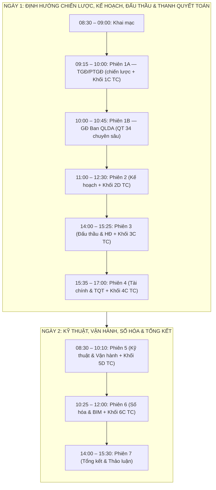
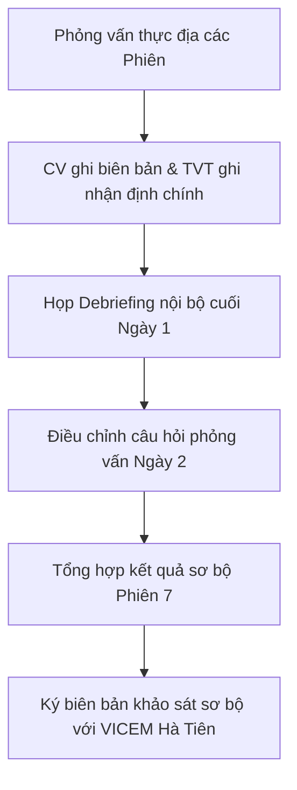

# KỊCH BẢN CHI TIẾT KHẢO SÁT THỰC ĐỊA 2 NGÀY
## DỰ ÁN TƯ VẤN QUY TRÌNH QLDA ĐẦU TƯ XÂY DỰNG — VICEM HÀ TIÊN

* **Hợp đồng:** HĐ_013/CSS_CIC_2026
* **Phương pháp luận:** "Từ pháp lý đến thực tiễn — Từ thực tiễn đến quy trình"
* **Thời gian thực hiện:** 02 ngày thực địa (Ngày T+10 và T+11)
* **Tài liệu căn cứ:** [KH_KhaoSat_VICEM_HaTien.md](file:///d:/QuocAnh/2026/01.Project/cic-vicem-erp/Quy%20tr%C3%ACnh%20QLDA/TaiLieu_HoiThoai_ChinhSua/KH_KhaoSat_VICEM_HaTien.md) và [BoiCauHoi_KhaoSat_ThucDia.md](file:///d:/QuocAnh/2026/01.Project/cic-vicem-erp/Quy%20tr%C3%ACnh%20QLDA/04_KeHoach_BoCauHoi_KhaoSat/BoiCauHoi_KhaoSat_ThucDia.md)

---

## PHẦN 1: CÔNG TÁC CHUẨN BỊ & PHÂN CÔNG VAI TRÒ ĐOÀN KHẢO SÁT CIC (2 NHÂN SỰ)

### 1. Phân công nhân sự và Vai trò
Để phù hợp với cơ cấu đoàn khảo sát tinh gọn gồm **02 nhân sự** của CIC, vai trò và phạm vi nghiệp vụ được phân định rõ ràng nhằm đảm bảo hiệu quả làm việc cao nhất:

*   **Tư vấn trưởng (TVT) - Trưởng đoàn:**
    *   *Trách nhiệm:* Chủ trì phiên Khai mạc, Phiên 1 (Ban Giám đốc), Phiên 2 (Kế hoạch), Phiên 3 (Đấu thầu & Hợp đồng) và Phiên 7 (Tổng kết).
    *   *Nghiệp vụ phụ trách:* Định hướng chiến lược, mô hình tổ chức Ban QLDA, phân cấp ủy quyền, ma trận phân định trách nhiệm, quy trình đấu thầu, thực hiện hợp đồng và các khoảng cách pháp lý theo Luật Xây dựng 135/2025 và Luật Đấu thầu 22/2023.
*   **Chuyên viên tư vấn (CV) - Thành viên đoàn (kiêm Thư ký):**
    *   *Trách nhiệm:* Chủ trì Phiên 4 (Tài chính & Thanh quyết toán), Phiên 5 (Kỹ thuật & Vận hành), Phiên 6 (Công nghệ & Số hóa). Thực hiện ghi chép biên bản chi tiết tất cả 7 phiên, ghi âm (sau khi được sự đồng ý) và thu hồi tài liệu minh chứng.
    *   *Nghiệp vụ phụ trách:* Quản lý chất lượng thiết kế/dự toán, nghiệm thu giám sát thi công, quy trình bàn giao - bảo hành - bảo trì, Mô hình thông tin công trình (BIM), Môi trường dữ liệu chung (CDE), tạm ứng, thanh quyết toán (Nghị định 193/2026/NĐ-CP) và số hóa/lưu trữ tài liệu (QT 161).

### 2. Danh mục tài liệu Đoàn khảo sát cần mang theo
*   Bản in 02 bộ Quy trình hiện hành của VICEM Hà Tiên (QT 34, 35, 36, 37, 16, 17, 18, 161).
*   Bản đối chiếu sơ bộ Luật Xây dựng 135/2025 và Luật Xây dựng 2014 để tra cứu nhanh.
*   Biên bản bàn giao tài liệu (mẫu trống) để ký nhận khi thu thập hồ sơ thực tế.
*   Sổ tay ghi chép và các thiết bị hỗ trợ ghi âm.

---

## PHẦN 2: LỊCH TRÌNH & KỊCH BẢN CHI TIẾT TỪNG PHIÊN KHẢO SÁT (2 NGÀY)



---

### NGÀY 1: ĐỊNH HƯỚNG CHIẾN LƯỢC, KẾ HOẠCH, ĐẤU THẦU & THANH QUYẾT TOÁN

#### PHIÊN KHAI MẠC (08:30 – 09:00)
*   **Địa điểm:** Phòng họp chính VICEM Hà Tiên.
*   **Thành phần tham dự:**
    *   *VICEM Hà Tiên:* Giám đốc Ban QLDA, Trưởng/Phó các phòng thuộc Ban QLDA, đại diện các phòng ban Công ty (KTPC, TCKT, KHCL, TTĐ).
    *   *CIC:* TVT và CV (toàn đoàn).
*   **Mục tiêu:** Thống nhất mục tiêu, kỳ vọng, phương pháp làm việc và lịch trình chi tiết của đợt khảo sát 2 ngày.

##### Kịch bản điều phối (30 phút):
1.  **08:30 – 08:40 (10 phút):** Giám đốc Ban QLDA VICEM Hà Tiên tuyên bố lý do, giới thiệu thành phần tham dự phía VICEM và phát biểu chỉ đạo về tầm quan trọng của đợt khảo sát (đồng bộ hệ thống quy trình trước 01/07/2026).
2.  **08:40 – 08:50 (10 phút):** TVT giới thiệu đoàn tư vấn, trình bày ngắn gọn phương pháp luận *"Từ pháp lý đến thực tiễn — Từ thực tiễn đến quy trình"* và 3 đầu ra trọng tâm của dự án.
3.  **08:50 – 09:00 (10 phút):** Thống nhất cách thức phối hợp ghi chép, cung cấp tài liệu minh chứng và chụp ảnh lưu niệm khởi động đợt làm việc.

---

#### PHIÊN 1: BAN GIÁM ĐỐC (09:15 – 10:45) — 2 PHÂN ĐOẠN

> **Cấu trúc phiên:** Phiên được chia thành 2 phân đoạn liền tiếp. Phân đoạn (a) dành riêng cho TGĐ/PTGĐ (lãnh đạo cấp cao rời sau 10:00); Phân đoạn (b) tiếp tục với GĐ Ban QLDA — giúp cán bộ cấp dưới chia sẻ thực chất hơn khi không còn cấp trên trực tiếp trong phòng.

---

##### PHÂN ĐOẠN (a): TGĐ / PTGĐ (09:15 – 10:00 | 45 phút)
*   **Đối tượng:** Tổng Giám đốc / Phó Tổng Giám đốc phụ trách Đầu tư.
*   **Đoàn CIC:** TVT (chủ trì), CV (ghi chép).

**Kịch bản phân bổ thời gian:**
```
[09:15] ── Mở đầu phiên (5 phút)
[09:20] ── Khối 1A: Chiến lược & Mô hình tổ chức Ban QLDA (25 phút — câu 1–4)
[09:45] ── Khối 1B: Phân cấp ủy quyền & Chuyển đổi số (5 phút — câu 5, 8 ưu tiên)
[09:50] ── Khối 1C (TC): Chấm điểm 3 phương án tổ chức Ban QLDA (9 câu — 10 phút)
[10:00] ── Cảm ơn & Kết thúc phân đoạn (a), TGĐ/PTGĐ rời phòng
```

**Tiến trình:**
1.  **Mở đầu (09:15–09:20):** TVT cảm ơn Ban Giám đốc, nêu mục tiêu phân đoạn: nắm định hướng vĩ mô và tư duy lãnh đạo về phân cấp, ủy quyền và mô hình Ban QLDA.
2.  **Khối 1A — Chiến lược & Mô hình tổ chức (09:20–09:45):**
    *   *Câu hỏi 1:* Định hướng và tầm nhìn của Ban lãnh đạo về mô hình hoạt động của Ban QLDA trong 3–5 năm tới?
        *   *Đào sâu:* Ban QLDA hoạt động như đơn vị quản lý chuyên nghiệp chủ động hay cánh tay nối dài thực thi thủ tục hành chính?
    *   *Câu hỏi 2:* Ban lãnh đạo đánh giá thế nào về hiệu quả hoạt động của Ban QLDA theo mô hình hiện tại? Có cần thiết phải chuyển đổi sang mô hình **Ban QLDA chuyên ngành / Ban QLDA khu vực** (có tư cách pháp nhân, tài khoản riêng, tự chủ tài chính) hay giữ nguyên mô hình trực thuộc như hiện nay?
        *   *Đào sâu:* Đâu là rào cản lớn nhất của mô hình trực thuộc hiện tại (Ví dụ: Chậm ra quyết định, nhân sự thiếu động lực do cơ chế lương áp dụng thang bảng lương công ty)?
    *   *Câu hỏi 3:* Khi chuyển Tổ Chuyên gia đánh giá hồ sơ dự thầu về trực thuộc Ban QLDA quản lý trực tiếp, Ban Giám đốc kỳ vọng gì về sự thay đổi tính chịu trách nhiệm và tốc độ giải quyết thủ tục lựa chọn nhà thầu?
        *   *Đào sâu:* Làm thế nào để đảm bảo tính khách quan và phòng ngừa xung đột lợi ích khi Tổ Chuyên gia nằm chung trong Ban QLDA với đơn vị lập hồ sơ mời thầu?
    *   *Câu hỏi 4:* Định biên nhân sự và cơ chế thu hút, giữ chân nhân tài của Ban QLDA: Ban Giám đốc có định hướng gì về cơ chế lương, thưởng trích từ chi phí quản lý dự án để tạo động lực cho cán bộ dự án?
3.  **Khối 1B — Phân cấp & Chuyển đổi số (09:45–09:50, hỏi nhanh 2 câu ưu tiên):**
    *   *Câu hỏi 5:* Cơ chế phân cấp/ủy quyền hiện tại: Tổng Giám đốc ủy quyền cho Giám đốc Ban QLDA đến ngưỡng bao nhiêu (Phê duyệt thiết kế - dự toán, chỉ định thầu, ký kết hợp đồng, thanh quyết toán)? Có cần mở rộng thẩm quyền cho Giám đốc Ban QLDA để tăng tính chủ động?
        *   *Đào sâu:* Nút thắt lớn nhất khi Giám đốc Ban phải trình duyệt lên Tổng Giám đốc là gì? Có gặp tình trạng "quyết định nhỏ cũng phải trình" không?
    *   *Câu hỏi 8:* Giới hạn từ quy chế Tổng Công ty VICEM đối với việc tái cơ cấu Ban QLDA và phân cấp ủy quyền tại VICEM Hà Tiên là gì?
4.  **Khối 1C — Tiêu chí (TC): Chấm điểm 3 phương án tổ chức Ban QLDA (09:50–10:00):**
    *   TVT trình bày nhanh 3 phương án PA1/PA2/PA3, phát phiếu chấm điểm 9 tiêu chí, thu lại ngay tại chỗ.
    *   *(Tham chiếu: Bộ câu hỏi — Khối 1C, 9 câu TC.)*
5.  **Kết thúc phân đoạn (a) lúc 10:00** — TVT cảm ơn TGĐ/PTGĐ, mời rời phòng. CV lưu biên bản phân đoạn (a).

---

##### PHÂN ĐOẠN (b): GĐ BAN QLDA (10:00 – 10:45 | 45 phút)
*   **Đối tượng:** Giám đốc Ban QLDA (tiếp tục ở lại từ phân đoạn a).
*   **Đoàn CIC:** TVT (chủ trì), CV (ghi chép).

**Kịch bản phân bổ thời gian:**
```
[10:00] ── Chuyển tiếp & Khung phiên (3 phút)
[10:03] ── Khối 1B (tiếp): Phân cấp ủy quyền & vận hành thực tế (27 phút — câu 6, 7)
[10:30] ── Tổng kết & Xác nhận biên bản phiên 1 toàn bộ (15 phút)
```

**Tiến trình:**
1.  **Chuyển tiếp (10:00–10:03):** TVT mời GĐ Ban QLDA tiếp tục các nội dung chuyên sâu về vận hành thực tế. Không có cấp trên trong phòng — mời chia sẻ thực chất hơn về các điểm nghẽn nội bộ.
2.  **Khối 1B (tiếp) — Vận hành thực tế & Phối hợp nội bộ (10:03–10:30):**
    *   *Câu hỏi 6:* Quy trình phối hợp ngang giữa Ban QLDA và các phòng ban Công ty (Tài chính - Kế toán, Kiểm tra Pháp chế, Tổ Thẩm định): Ban Giám đốc nhận thấy có những điểm nghẽn nào cần tháo gỡ? Định hướng thiết lập Ma trận phân cấp quyết định mới?
    *   *Câu hỏi 7:* Mô hình thông tin công trình & Chuyển đổi số: Ban lãnh đạo sẵn sàng đầu tư ngân sách cho hạ tầng công nghệ, phần mềm quản lý và đào tạo nhân sự triển khai mô hình thông tin công trình/môi trường dữ liệu chung bắt buộc theo lộ trình thế nào?
    *   *(Bổ sung thêm các câu hỏi phát sinh từ phân đoạn (a) nếu cần.)*
3.  **Tổng kết & Xác nhận biên bản toàn phiên (10:30–10:45):** CV đọc lại các điểm chính ghi nhận. TVT xác nhận tài liệu cần thu thập.

**Tài liệu/Minh chứng cần thu thập tại phiên:**
*   Quyết định phân công nhiệm vụ trong Ban Giám đốc Công ty.
*   Văn bản ủy quyền hiện hành từ Tổng Giám đốc cho Giám đốc Ban QLDA.

---

#### PHIÊN 2: KẾ HOẠCH & CHIẾN LƯỢC (11:00 – 12:30)
*   **Đối tượng phỏng vấn:** Phòng Kế hoạch Chiến lược (KHCL), Tổ Thẩm định dự án (TTĐ) + Giám đốc Ban QLDA.
*   **Đoàn CIC:** TVT (chủ trì hỏi), CV (ghi chép biên bản & hỗ trợ).
*   **Quy trình liên quan:** QT 34 (Quản lý dự án tổng thể), Quy trình mới (Giám sát, đánh giá và báo cáo dự án định kỳ), Quy trình lập và phê duyệt kế hoạch đầu tư.

##### Kịch bản chi tiết & Phân bổ thời gian (90 phút):
```
[11:00] ── Khối 2A: Quy trình 34 & Vai trò của Tổ Thẩm định dự án (35 phút)
[11:35] ── Khối 2B: Quy trình giám sát, đánh giá & báo cáo định kỳ mới (20 phút)
[11:55] ── Khối 2C: Lập kế hoạch đầu tư & Đánh giá hiệu quả sau đầu tư (20 phút)
[12:15] ── Khối 2D (TC): Chấm điểm 3 phương án tổ chức Ban QLDA (4 câu — 10 phút)
[12:25] ── Tóm tắt ghi nhận & Kết thúc phiên (5 phút)
```

##### Tiến trình phỏng vấn & Câu hỏi chi tiết:
1.  **Khối 2A: Quy trình 34 — Quản lý dự án tổng thể & Thẩm định (11:00 - 11:35):**
    *   *Câu hỏi 1:* Xin mô tả quy trình từ khi phát sinh nhu cầu đầu tư đến khi có Quyết định đầu tư — các bước chính, ai làm gì, ai duyệt?
    *   *Câu hỏi 2:* Quy trình phân loại dự án (nhóm A, B, C) hiện đang áp dụng theo tiêu chí nào? Ngưỡng phân cấp phê duyệt?
    *   *Câu hỏi 3:* Kế hoạch Tổng hợp soạn thảo → Giám đốc Ban QLDA ký tắt → Tổng Giám đốc ký → Hội đồng quản trị phê duyệt: chuỗi phê duyệt này có đúng cho tất cả loại quyết định không, hay có trường hợp ngoại lệ/ủy quyền?
    *   *Câu hỏi 4:* Vai trò của Người đại diện vốn trong quy trình: trường hợp nào phải trình Người đại diện vốn? Có vướng mắc gì về thời gian chờ phê duyệt?
    *   *Câu hỏi 5:* Quy trình phê duyệt dự án hiện tại đang gặp vướng mắc lớn nhất ở bước nào? (Từ khâu lập chủ trương, thẩm định đến phê duyệt quyết định đầu tư).
        *   *Đào sâu:* Quy định nội bộ hiện hành về phân cấp thẩm quyền phê duyệt dự án đầu tư xây dựng (giữa Hội đồng quản trị và Ban Giám đốc) đang được phân định dựa trên những tiêu chí nào?
    *   *Câu hỏi 6:* Tổ Thẩm định dự án thẩm định những nội dung gì? (Báo cáo đề xuất chủ trương đầu tư, Báo cáo nghiên cứu khả thi, dự toán, kế hoạch lựa chọn nhà thầu, hồ sơ mời thầu — tất cả hay chỉ một số?). Quy trình thẩm định nội bộ: nhận hồ sơ → thẩm định → báo cáo mất thời gian trung bình bao lâu? Tổ Thẩm định có thành viên cố định hay thay đổi theo dự án?
2.  **Khối 2B: Quy trình mới — Giám sát, đánh giá và báo cáo dự án định kỳ (11:35 - 11:55):**
    *   *Câu hỏi 7:* Hiện tại, báo cáo tình hình dự án gửi cho Tổng Giám đốc/Hội đồng quản trị/Tổng công ty VICEM theo cơ chế nào? Biểu mẫu? Tần suất?
    *   *Câu hỏi 8:* Có chỉ số đánh giá hiệu quả dự án không (tiến độ, chi phí, chất lượng)? Khi dự án có vấn đề (chậm tiến độ, vượt chi phí), cơ chế cảnh báo sớm là gì?
    *   *Câu hỏi 9:* Nếu xây dựng quy trình báo cáo định kỳ mới, anh/chị mong muốn cơ chế báo cáo và chia sẻ thông tin như thế nào? Hiện tại Công ty có gặp khó khăn gì trong việc tổng hợp số liệu quyết toán dự án hàng năm không?
3.  **Khối 2C: Phòng Kế hoạch Chiến lược — Lập kế hoạch đầu tư dự án (11:55 - 12:15):**
    *   *Câu hỏi 10:* Quy trình lập kế hoạch đầu tư trung hạn (5 năm) và hàng năm cho các dự án tại VICEM Hà Tiên hiện được thực hiện như thế nào? Dựa trên các căn cứ và chỉ tiêu đánh giá nào?
    *   *Câu hỏi 11:* Sự phân định trách nhiệm và quy trình phối hợp giữa phòng Kế hoạch Chiến lược và Ban QLDA trong giai đoạn chuẩn bị dự án (từ chủ trương đầu tư đến khi ban hành Quyết định đầu tư) hiện có vướng mắc hay chồng chéo nào không?
        *   *Đào sâu:* Ai chủ trì lập Báo cáo nghiên cứu tiền khả thi (Pre-FS) / Báo cáo đề xuất chủ trương đầu tư? Sự chuyển giao hồ sơ giữa hai phòng ban này tại thời điểm phê duyệt chủ trương đầu tư diễn ra thế nào?
    *   *Câu hỏi 12:* Quy trình theo dõi, đánh giá hiệu quả đầu tư dự án sau khi hoàn thành bàn giao (ví dụ: đánh giá công suất thực tế đạt được, các chỉ tiêu tài chính như NPV, IRR so với phương án ban đầu) có được thực hiện định kỳ không? Đơn vị nào chủ trì?
    *   *Câu hỏi 13:* Vướng mắc lớn nhất trong công tác lập kế hoạch đầu tư và xin phê duyệt chủ trương đầu tư từ Tổng công ty VICEM là gì?
4.  **Khối 2D (TC) — Tiêu chí: Chấm điểm 3 phương án tổ chức Ban QLDA (12:15 - 12:25):**
    *   TVT/CV phát phiếu chấm điểm 4 tiêu chí nhóm **Kế hoạch & Thẩm định** (tiêu chí liên quan đến hiệu quả phê duyệt dự án, tốc độ thẩm định, phân cấp ngân sách đầu tư). Thu phiếu trước khi giải lao trưa.
    *   *(Tham chiếu: Bộ câu hỏi — Khối 2D, 4 câu TC.)*
5.  **Tài liệu/Minh chứng cần thu thập tại phiên:**
    *   Mẫu Tờ trình xin phê duyệt chủ trương đầu tư và Quyết định đầu tư thực tế.
    *   Quyết định thành lập Tổ Thẩm định dự án nội bộ gần nhất.
    *   Mẫu báo cáo giám sát, đánh giá đầu tư đang áp dụng gửi cơ quan quản lý.

---

#### PHIÊN 3: ĐẤU THẦU & HỢP ĐỒNG (14:00 – 15:25)
*   **Đối tượng phỏng vấn:** Phòng Kiểm tra Pháp chế (KTPC), Tổ Chuyên gia đánh giá hồ sơ dự thầu (TCG), Phòng Vật tư (PVT) + Giám đốc Ban QLDA.
*   **Đoàn CIC:** TVT (chủ trì hỏi), CV (ghi chép biên bản & hỗ trợ).
*   **Quy trình liên quan:** QT 35 (Lựa chọn nhà thầu), QT 37 (Thực hiện hợp đồng), Quy trình mới về quản lý tranh chấp hợp đồng.

##### Kịch bản chi tiết & Phân bổ thời gian (85 phút):
```
[14:00] ── Khối 3A: Đấu thầu, Đấu thầu qua mạng & Chuyển giao Tổ Chuyên gia (35 phút)
[14:35] ── Khối 3B: Quản lý thực hiện hợp đồng, kiểm soát phát sinh & Pháp chế (35 phút)
[15:10] ── Khối 3C (TC): Chấm điểm 3 phương án — góc độ pháp lý & kiểm soát (3 câu — 10 phút)
[15:20] ── Tổng kết nhanh phiên làm việc (5 phút)
```

##### Tiến trình phỏng vấn & Câu hỏi chi tiết:
1.  **Khối 3A: Quy trình 35 — Lựa chọn nhà thầu & Tổ Chuyên gia (14:00 - 14:35):**
    *   *Câu hỏi 1:* Các hình thức lựa chọn nhà thầu đang sử dụng phổ biến nhất? Tỷ lệ đấu thầu rộng rãi / chỉ định thầu / chào hàng cạnh tranh?
    *   *Câu hỏi 2:* Quy trình lập kế hoạch lựa chọn nhà thầu → Thẩm định (Tổ Thẩm định) → Phê duyệt: thời gian trung bình bao lâu? Điểm nghẽn ở đâu?
    *   *Câu hỏi 3:* **Chuyển giao Tổ Chuyên gia**: Hiện tại Tổ Chuyên gia đang độc lập cấp Công ty. Khi chuyển giao trực thuộc quản lý trực tiếp của Ban QLDA, quy trình thành lập, bổ nhiệm thành viên và cơ chế vận hành độc lập/giám sát sẽ thay đổi như thế nào?
        *   *Đào sâu:* Làm sao để Giám đốc Ban QLDA vừa là người quản lý trực tiếp hành chính của Tổ Chuyên gia, vừa là người trình duyệt kết quả lựa chọn nhà thầu lên Tổng Giám đốc mà không vi phạm nguyên tắc "vừa đá bóng vừa thổi còi"?
    *   *Câu hỏi 4:* Tổ Chuyên gia được thành lập theo Quyết định của ai? Tiêu chí lựa chọn thành viên? Có khó khăn gì về nhân sự/năng lực của Tổ Chuyên gia khi đánh giá các gói thầu công nghệ/mô hình thông tin công trình phức tạp?
    *   *Câu hỏi 5:* Quy trình đánh giá: Hồ sơ đề xuất kỹ thuật qua mạng → Hồ sơ đề xuất tài chính qua mạng → Xếp hạng — có khó khăn gì? Đã sử dụng hệ thống mạng đấu thầu quốc gia ở mức nào? Gặp vấn đề gì?
    *   *Câu hỏi 6:* Công tác lựa chọn nhà thầu hiện nay đang gặp vướng mắc ở các khâu nào (như lập hồ sơ mời thầu, đăng tải thông tin, hay chấm thầu)?
2.  **Khối 3B: Quy trình 37 & Pháp lý hợp đồng (Kiểm tra Pháp chế) (14:35 - 15:10):**
    *   *Câu hỏi 7:* Sau khi ký hợp đồng, quy trình giám sát thực hiện hợp đồng diễn ra như thế nào? Ai theo dõi tiến độ, ai xác nhận khối lượng?
    *   *Câu hỏi 8:* Khi phát sinh (thay đổi thiết kế, điều chỉnh giá, gia hạn), quy trình xử lý như thế nào? Ai có thẩm quyền quyết định?
        *   *Đào sâu:* Quy trình xử lý phát sinh vượt dự toán gói thầu nhưng không vượt tổng mức đầu tư hiện tại đang chạy như thế nào? Mất bao nhiêu lâu để phê duyệt một phụ lục phát sinh?
    *   *Câu hỏi 9:* Trường hợp phải điều chỉnh hợp đồng (phụ lục): trình tự, ai duyệt, thời gian xử lý trung bình?
    *   *Câu hỏi 10:* Phòng Kiểm tra Pháp chế tham gia vào bước nào của quy trình hợp đồng? Rà soát dự thảo hợp đồng? Thương thảo? Sự phối hợp giữa phòng Kiểm tra Pháp chế (Công ty) và Ban QLDA có gặp vướng mắc về mặt thời gian?
    *   *Câu hỏi 11:* Loại hợp đồng xây dựng phổ biến nhất tại VICEM Hà Tiên? (trọn gói, đơn giá cố định, đơn giá điều chỉnh?). Vấn đề pháp lý phát sinh nhiều nhất trong hợp đồng đầu tư xây dựng? (tranh chấp, phạt vi phạm, điều chỉnh giá?).
    *   *Câu hỏi 12:* Quy trình thương thảo, ký kết và quản lý thực hiện hợp đồng hiện nay có quy định rõ ràng về thời hạn phản hồi ý kiến hoặc thời hạn xử lý các yêu cầu thay đổi/phát sinh từ nhà thầu hay không?
    *   *Câu hỏi 13:* Mức phạt vi phạm hợp đồng và các biện pháp chế tài đối với nhà thầu chậm tiến độ hiện đang áp dụng như thế nào? Trong thực tế đã có trường hợp nào phải áp dụng phạt hợp đồng chưa?
3.  **Khối 3C (TC) — Tiêu chí: Chấm điểm 3 phương án — góc độ pháp lý & kiểm soát (15:10 - 15:20):**
    *   TVT/CV phát phiếu 3 tiêu chí nhóm **Pháp lý & Kiểm soát hợp đồng** (tiêu chí liên quan đến kiểm soát rủi ro hợp đồng, cơ chế pháp lý của từng mô hình Ban QLDA). Thu phiếu trước giải lao.
    *   *(Tham chiếu: Bộ câu hỏi — Khối 3C, 3 câu TC.)*
4.  **Tài liệu/Minh chứng cần thu thập tại phiên:**
    *   01 bộ Hồ sơ mời thầu + Báo cáo đánh giá E-HSDT thực tế của một dự án gần đây.
    *   01 Hợp đồng xây lắp tiêu biểu (kèm các phụ lục điều chỉnh nếu có).
    *   Quy trình phối hợp hiện hành giữa Ban QLDA và phòng KTPC trong việc rà soát hợp đồng.

---

#### PHIÊN 4: TÀI CHÍNH & THANH QUYẾT TOÁN (15:35 – 17:00)
*   **Đối tượng phỏng vấn:** Phòng Tài chính - Kế toán Công ty (TCKT) + Ban QLDA (cán bộ kế toán dự án).
*   **Đoàn CIC:** CV (chủ trì hỏi & ghi chép), TVT (hỗ trợ).
*   **Quy trình liên quan:** QT 17 (Thanh quyết toán hợp đồng), QT 18 (Quyết toán dự án hoàn thành).

##### Kịch bản chi tiết & Phân bổ thời gian (85 phút):
```
[15:35] ── Khối 4A: Quy trình thanh toán khối lượng hoàn thành & Phối hợp nội bộ (35 phút)
[16:10] ── Khối 4B: Quy trình quyết toán dự án hoàn thành (35 phút)
[16:45] ── Khối 4C (TC): Chấm điểm 3 phương án — góc độ tài chính & kiểm toán (4 câu — 10 phút)
[16:55] ── Tổng kết nhanh & Xác nhận nội dung ghi nhận (5 phút)
```

##### Tiến trình phỏng vấn & Câu hỏi chi tiết:
1.  **Khối 4A: Quy trình 17 — Thanh, quyết toán hợp đồng đầu tư xây dựng (15:35 - 16:10):**
    *   *Câu hỏi 1:* Quy trình tạm ứng: tỷ lệ tạm ứng thường áp dụng? Hồ sơ tạm ứng gồm gì? Kế toán Dự án hay phòng Tài chính - Kế toán Công ty xử lý?
    *   *Câu hỏi 2:* Quy trình thanh toán theo khối lượng: bước xác nhận khối lượng → lập hồ sơ thanh toán → kiểm tra → phê duyệt — mô tả cụ thể?
    *   *Câu hỏi 3:* **Mối quan hệ Ban QLDA - Tài chính Kế toán**: Phân công giữa Kế toán Dự án (Ban QLDA) và phòng Tài chính - Kế toán (Công ty) trong thanh toán: ai làm gì? Có chồng chéo chứng từ hoặc thời gian kiểm tra bị kéo dài không? Kiến nghị tối ưu hóa luồng chứng từ?
        *   *Đào sâu:* Kế toán dự án có kiểm tra lại khối lượng đã được phòng Kỹ thuật nghiệm thu không? Hay chỉ kiểm tra tính hợp lệ của hóa đơn, chứng từ và số học?
    *   *Câu hỏi 4:* Thời gian trung bình từ khi nhà thầu nộp hồ sơ thanh toán đến khi được thanh toán thực tế? Điểm nghẽn ở đâu?
    *   *Câu hỏi 5:* Hồ sơ hoàn công: phòng Kỹ thuật xác nhận → Kế toán Dự án tổng hợp → phòng Tài chính - Kế toán Công ty kiểm tra — đúng không? Có vướng mắc gì không?
2.  **Khối 4B: Quy trình 18 — Quyết toán dự án hoàn thành (16:10 - 16:45):**
    *   *Câu hỏi 6:* Quy trình quyết toán dự án hoàn thành hiện tại: trình tự cụ thể, hồ sơ gồm gì? Ai lập báo cáo quyết toán? Kế toán Dự án lập hay thuê kiểm toán độc lập?
    *   *Câu hỏi 7:* Ai thẩm tra/phê duyệt quyết toán? Tổng Giám đốc hay Hội đồng quản trị? Ngưỡng phân cấp phê duyệt? Thời gian quyết toán trung bình bao lâu? Vướng mắc phổ biến nhất?
    *   *Câu hỏi 8:* Dự án nào gần nhất đã quyết toán xong? Dự án nào đang chờ quyết toán chậm trễ và lý do tại sao?
    *   *Câu hỏi 9:* Thực tế tại VICEM Hà Tiên đã có trường hợp nào thực hiện quyết toán dự án thành phần, tiểu dự án hoặc hạng mục công trình độc lập chưa? Quy trình thực hiện như thế nào?
    *   *Câu hỏi 10:* Hồ sơ trình thẩm tra quyết toán: có đầy đủ quyết toán A-B (Bảng quyết toán) + thanh lý hợp đồng + Biên bản nghiệm thu hoàn thành + báo cáo kiểm toán không?
    *   *Câu hỏi 11:* Thời gian thực tế để lập hồ sơ quyết toán dự án hoàn thành từ lúc bàn giao đưa vào sử dụng thường mất bao lâu? Có gặp vướng mắc kéo dài ở khâu nào nhất?
    *   *Câu hỏi 12:* Đã gặp trường hợp nhà thầu không hợp tác hoặc chậm trễ quyết toán hợp đồng chưa? Cách thức xử lý hiện tại của công ty đối với các trường hợp này như thế nào?
3.  **Khối 4C (TC) — Tiêu chí: Chấm điểm 3 phương án — góc độ tài chính & kiểm toán (16:45 - 16:55):**
    *   CV phát phiếu 4 tiêu chí nhóm **Tài chính & Kiểm toán** (tiêu chí liên quan đến cơ chế tài chính, kiểm soát chi phí, tính minh bạch trong từng mô hình Ban QLDA). Thu phiếu trước khi kết thúc ngày 1.
    *   *(Tham chiếu: Bộ câu hỏi — Khối 4C, 4 câu TC.)*
4.  **Tài liệu/Minh chứng cần thu thập tại phiên:**
    *   01 bộ Hồ sơ thanh toán thực tế của gói thầu xây lắp (bao gồm bảng xác nhận khối lượng hoàn thành, hóa đơn, tờ trình thanh toán).
    *   01 Báo cáo quyết toán dự án hoàn thành đã được phê duyệt kèm Báo cáo kiểm toán độc lập.

---

### NGÀY 2: KỸ THUẬT, VẬN HÀNH, SỐ HÓA & TỔNG KẾT HỘI THẢO KHẢO SÁT

#### PHIÊN 5: KỸ THUẬT & VẬN HÀNH (08:30 – 10:10)
*   **Đối tượng phỏng vấn:** Phòng Kỹ thuật (PKT), Phòng An toàn môi trường (ATMT), Phòng Tổ chức hành chính (TCHC) + Ban QLDA.
*   **Đoàn CIC:** CV (chủ trì hỏi & ghi chép), TVT (hỗ trợ).
*   **Quy trình liên quan:** QT 36 (Quản lý chất lượng chuẩn bị đầu tư), QT 16 (Quản lý chất lượng hoạt động đầu tư), Quy trình mới về bàn giao/bảo hành/bảo trì, Quy trình an toàn lao động và môi trường.

> **Ghi chú ánh xạ bộ câu hỏi:** Kịch bản phiên 5 sử dụng câu hỏi từ Bộ câu hỏi theo cách sau: Khối 5A (kịch bản câu 1–4) ≡ Khối 5A (bộ câu hỏi, 9 câu). Khối 5B (kịch bản câu 5–7) ≡ bộ câu hỏi Khối 5B câu 5–7 trong số 6 câu; Khối 5C (kịch bản câu 8–9) ≡ bộ câu hỏi Khối 5C câu 8–9 trong số 4 câu. Thực địa chỉ hỏi các câu đại diện (câu mở, thực tiễn nhất); câu còn lại trong bộ câu hỏi dùng khi cần đào sâu.

##### Kịch bản chi tiết & Phân bổ thời gian (100 phút):
```
[08:30] ── Khối 5A: Quản lý khảo sát, thiết kế, nghiệm thu & Giám sát thi công (40 phút)
[09:10] ── Khối 5B: Quy trình mới về Bàn giao, bảo hành và bảo trì (30 phút)
[09:40] ── Khối 5C: Quy trình mới về An toàn lao động & Môi trường (15 phút)
[09:55] ── Khối 5D (TC): Chấm điểm 3 phương án — góc độ nhân sự kỹ thuật (5 câu — 10 phút)
[10:05] ── Tóm tắt ghi nhận phiên làm việc (5 phút)
```

##### Tiến trình phỏng vấn & Câu hỏi chi tiết:
1.  **Khối 5A: Quy trình 36 & Quy trình 16 — Quản lý chất lượng & Giám sát thi công (08:30 - 09:10):**
    *   *Câu hỏi 1 (Về Khảo sát & Thiết kế):* Hiện tại khâu lập Nhiệm vụ khảo sát/thiết kế và Thẩm định thiết kế nội bộ thực tế có thường bị kéo dài không? Khi áp dụng bước thiết kế FEED/thiết kế kỹ thuật tổng thể theo quy trình mới, cán bộ kỹ thuật đề xuất vai trò thẩm định của phòng Kỹ thuật và Tổ Thẩm định cần điều chỉnh thế nào để tối ưu hóa thời gian và làm rõ trách nhiệm?
    *   *Câu hỏi 2 (Về Nghiệm thu & Trách nhiệm pháp lý):* Quy định mới về việc *"Nghiệm thu của Chủ đầu tư không làm giảm/thay thế trách nhiệm của Nhà thầu về chất lượng"* dự kiến sẽ tác động thế nào đến tâm lý và cách thức nghiệm thu hiện nay? Trong thực tế công tác nghiệm thu công việc xây dựng có hay bị chậm trễ do hồ sơ hoàn công của nhà thầu không đầy đủ không?
    *   *Câu hỏi 3 (Về Số hóa & Ký số):* Trở ngại lớn nhất về mặt thiết bị, hạ tầng công nghệ và năng lực nhân sự tại công trường khi chuyển đổi sang ký số biên bản nghiệm thu và lập nhật ký điện tử trực tiếp hiện nay là gì?
    *   *Câu hỏi 4 (Về Thẩm duyệt PCCC & Kiểm tra nhà nước):* Những khó khăn hoặc vướng mắc thực tế làm kéo dài thời gian xin văn bản chấp thuận PCCC và kiểm tra nghiệm thu của cơ quan nhà nước (Bộ/Sở) đối với các công trình vừa qua là gì? Có gặp tình trạng chậm đưa tài sản vào sản xuất do các thủ tục này không?
2.  **Khối 5B: Quy trình mới — Bàn giao, bảo hành và bảo trì (09:10 - 09:40):**
    *   *Câu hỏi 5 (Về Phối hợp bàn giao tài sản):* Điểm nghẽn lớn nhất trong việc phối hợp bàn giao tài sản giữa Ban QLDA và đơn vị thụ hưởng (Nhà máy/Trạm nghiền) là gì? (Ví dụ: bàn giao thực tế nhanh để kịp sản xuất nhưng hồ sơ pháp lý, quyết toán và hạch toán tăng tài sản bị treo lâu). Giải pháp xử lý "nghiệm thu có điều kiện" thực tế hiện nay đang chạy thế nào để phòng ngừa rủi ro pháp lý?
    *   *Câu hỏi 6 (Về Khoảng trống Bảo trì công trình xây dựng):* VICEM Hà Tiên đã có quy trình bảo trì thiết bị công nghệ rất tốt, nhưng quy trình bảo trì cho phần xây dựng (như silo xi măng, tháp trao đổi nhiệt, nhà xưởng) hiện đang gặp khó khăn gì (nhân sự chuyên môn, định mức chi phí, lập kế hoạch bảo trì xây dựng hàng năm)?
    *   *Câu hỏi 7 (Về Đánh giá an toàn chịu lực định kỳ):* Các công trình công nghiệp quy mô lớn (silo, tháp sấy, ống khói) đã bao giờ được tổ chức đánh giá an toàn chịu lực định kỳ chưa? Đơn vị gặp khó khăn gì về mặt thủ tục và kinh phí khi thực hiện đánh giá này?
3.  **Khối 5C: Quy trình mới — An toàn lao động và môi trường thi công (09:40 - 09:55):**
    *   *Câu hỏi 8 (Về Nhân sự quản lý an toàn):* Hiện cán bộ giám sát Ban QLDA đang kiêm nhiệm quản lý an toàn. Khi quy chế mới yêu cầu phải bố trí nhân sự quản lý an toàn có đào tạo chuyên môn phù hợp, Ban QLDA dự kiến sẽ bố trí và phân bổ trách nhiệm thế nào để đáp ứng thực tế mà không phình bộ máy?
    *   *Câu hỏi 9 (Về Biện pháp an toàn & Môi trường của nhà thầu):* Khó khăn lớn nhất của Ban QLDA trong việc giám sát, chế tài nhà thầu thực hiện biện pháp bảo vệ môi trường, chống bụi mịn và tiếng ồn trong khuôn viên nhà máy đang vận hành là gì? Chế tài phạt hiện tại có đủ răn đe không?
4.  **Khối 5D (TC) — Tiêu chí: Chấm điểm 3 phương án — góc độ nhân sự kỹ thuật (09:55 - 10:05):**
    *   CV phát phiếu 5 tiêu chí nhóm **Nhân sự Kỹ thuật & Vận hành** (tiêu chí liên quan đến năng lực chuyên môn kỹ thuật, cơ chế giám sát chất lượng trong từng mô hình Ban QLDA). Thu phiếu trước giải lao.
    *   *(Tham chiếu: Bộ câu hỏi — Khối 5D, 5 câu TC.)*
5.  **Tài liệu/Minh chứng cần thu thập tại phiên:**
    *   01 Nhiệm vụ khảo sát + Thiết kế kỹ thuật được duyệt.
    *   01 Biên bản nghiệm thu công việc xây lắp thực tế.
    *   01 Biên bản bàn giao công trình đưa vào sử dụng thực tế cho Nhà máy thành viên.
    *   Mẫu quy trình bảo trì thiết bị/công trình đang áp dụng tại các Nhà máy.

---

#### PHIÊN 6: CÔNG NGHỆ & SỐ HÓA (10:25 – 12:00)
*   **Đối tượng phỏng vấn:** Phòng Công nghệ thông tin Công ty (CNTT), Cán bộ phụ trách lưu trữ Ban QLDA + Đại diện phòng Kỹ thuật.
*   **Đoàn CIC:** CV (chủ trì hỏi & ghi chép), TVT (hỗ trợ).
*   **Quy trình liên quan:** QT 161 (Số hóa và lưu trữ tài liệu), Quy trình mới về quản lý BIM và Môi trường dữ liệu chung CDE.

##### Kịch bản chi tiết & Phân bổ thời gian (95 phút):
```
[10:25] ── Khối 6A: Hiện trạng ứng dụng BIM & Thiết lập CDE theo Nghị định mới (45 phút)
[11:10] ── Khối 6B: Đánh giá Quy trình lưu trữ 161, số hóa & Hồ sơ hoàn công điện tử (35 phút)
[11:45] ── Khối 6C (TC): Chấm điểm 3 phương án — góc độ công nghệ & hạ tầng số (3 câu — 10 phút)
[11:55] ── Tổng kết nhanh & Xác nhận các điểm nghẽn hạ tầng (5 phút)
```

##### Tiến trình phỏng vấn & Câu hỏi chi tiết:
1.  **Khối 6A: Mô hình thông tin công trình (BIM) & Môi trường dữ liệu chung (CDE) (10:25 - 11:10):**
    *   *Câu hỏi 1:* VICEM Hà Tiên đã có dự án nào yêu cầu nhà thầu nộp mô hình thông tin công trình (BIM) chưa? Đã từng đưa yêu cầu này vào hồ sơ mời thầu/hồ sơ yêu cầu chưa?
    *   *Câu hỏi 2:* Nền tảng chia sẻ tài liệu dự án hiện tại với nhà thầu là gì (Ví dụ: Email, Zalo, Google Drive, hay hệ thống CDE chuyên nghiệp như Autodesk Construction Cloud, Trimble Connect)? Nhân sự phòng Kỹ thuật/CNTT có ai biết sử dụng các phần mềm chuyên dụng như Revit, Navisworks hoặc các trình xem mô hình không?
    *   *Câu hỏi 3:* Đơn vị có năng lực thẩm tra mô hình thông tin công trình (kiểm tra phát hiện xung đột, kiểm tra tuân thủ thiết kế) không? Hay cần thuê tư vấn chuyên nghiệp độc lập?
    *   *Câu hỏi 4:* Hiện trạng hạ tầng công nghệ thông tin và năng lực phần mềm của Công ty hiện nay có thể hỗ trợ ở mức độ nào cho việc tiếp nhận, lưu trữ và khai thác các tệp tin mô hình thông tin công trình (BIM)?
2.  **Khối 6B: Quy trình số hóa và Lưu trữ hồ sơ hoàn thành (Quy trình 161) (11:10 - 11:45):**
    *   *Câu hỏi 5:* Hệ thống lưu trữ tài liệu dự án hiện tại (Quy trình 161): máy chủ nội bộ, thiết bị lưu trữ mạng (NAS), lưu trữ đám mây, hay ổ cứng cá nhân? Cấu trúc thư mục lưu trữ: theo Quy trình 161 hay mỗi phòng tự quản lý? Tỷ lệ tài liệu đã số hóa so với tài liệu giấy hiện nay đạt khoảng bao nhiêu %?
    *   *Câu hỏi 6:* Hiện tại công ty đã áp dụng hoặc có định hướng sử dụng nhật ký thi công điện tử, biên bản nghiệm thu điện tử (chữ ký số) chưa? Hạ tầng CNTT hiện tại của VICEM Hà Tiên có đáp ứng được nếu triển khai thực tế này không?
    *   *Câu hỏi 7:* Lưu trữ hồ sơ hoàn thành công trình: Quy trình lưu giữ hồ sơ dự án (bản gốc và bản chụp số) hiện tại đang quy định thời hạn lưu trữ bao nhiêu năm? Dung lượng lưu trữ trên máy chủ hoặc đám mây hiện tại có đáp ứng được nhu cầu lưu trữ hồ sơ số hóa lâu dài không?
3.  **Khối 6C (TC) — Tiêu chí: Chấm điểm 3 phương án — góc độ công nghệ & hạ tầng số (11:45 - 11:55):**
    *   CV phát phiếu 3 tiêu chí nhóm **Công nghệ & Hạ tầng số** (tiêu chí liên quan đến khả năng áp dụng BIM/CDE và mức độ chuyển đổi số được hỗ trợ trong từng mô hình Ban QLDA). Thu phiếu trước khi kết thúc phiên.
    *   *(Tham chiếu: Bộ câu hỏi — Khối 6C, 3 câu TC.)*
4.  **Tài liệu/Minh chứng cần thu thập tại phiên:**
    *   Cơ cấu thư mục lưu trữ tài liệu dự án trên máy chủ (chụp màn hình cấu trúc thực tế).
    *   Quy định/Hướng dẫn kỹ thuật về số hóa hồ sơ hiện hành của công ty.

---

#### PHIÊN 7: TỔNG KẾT & THẢO LUẬN CHUNG (14:00 – 15:30)
*   **Đối tượng tham gia:** Toàn bộ đại diện các phòng ban đã tham gia phỏng vấn trong 2 ngày (Ban Giám đốc, Ban QLDA, TCKT, KTPC, KHCL, TTĐ, CNTT).
*   **Chủ trì:** TVT.
*   **Đoàn CIC:** TVT (chủ trì điều phối), CV (ghi chép biên bản).
*   **Mục tiêu:** Thống nhất các phát hiện chính về khoảng cách pháp lý, nguyên tắc tái cơ cấu mô hình Ban QLDA, danh mục 12 quy trình và lộ trình phối hợp tiếp theo.

##### Kịch bản chi tiết & Phân bổ thời gian (90 phút):
```
[14:00] ── Trình bày Kết quả khảo sát nhanh & Phát hiện cốt lõi (15 phút)
[14:15] ── Thảo luận & Thống nhất Ma trận khoảng cách pháp lý (25 phút)
[14:40] ── Thảo luận & Định hướng mô hình tổ chức Ban QLDA mới (25 phút)
[15:05] ── Thống nhất Danh mục 12 Quy trình & Thứ tự ưu tiên (20 phút)
[15:25] ── Ký biên bản làm việc thực địa & Cam kết tiến độ (5 phút)
```

##### Nội dung thảo luận chi tiết:
1.  **Trình bày sơ bộ (14:00 - 14:15):** TVT đại diện CIC trình bày tóm tắt kết quả khảo sát trực tuyến trước đó kết hợp với các phát hiện chính thu được sau 6 phiên phỏng vấn sâu trực tiếp tại thực địa.
2.  **Xác nhận các khoảng cách pháp lý chính (14:15 - 14:40):**
    *   Đồng thuận về các điểm "hổng" pháp lý lớn nhất cần ưu tiên xử lý trước mốc 01/07/2026 (Đặc biệt là quy trình thẩm định thiết kế/dự toán mới, quy trình nghiệm thu bàn giao và lập quy trình bảo trì bắt buộc).
3.  **Thống nhất định hướng mô hình Ban QLDA (14:40 - 15:05):**
    *   Thống nhất nguyên tắc xây dựng Ma trận phân định trách nhiệm mới: làm rõ thẩm quyền của Giám đốc Ban QLDA để tăng tính chủ động, giảm tải hồ sơ trình duyệt không cần thiết lên Ban Giám đốc Công ty.
    *   Thống nhất cơ chế hoạt động của Tổ Chuyên gia đấu thầu sau khi chuyển giao quản lý hành chính về Ban QLDA.
4.  **Xác nhận danh mục 12 quy trình & Thứ tự ưu tiên soạn thảo (15:05 - 15:25):**
    *   *Ưu tiên 1 (Soạn thảo ngay):* Quy trình 34 (Tổng thể & Phân cấp thẩm quyền mới), Quy trình 35 & 36 (Đấu thầu và Quản lý thiết kế/dự toán theo luật mới), Quy trình bàn giao/bảo hành/bảo trì.
    *   *Ưu tiên 2 (Hoàn thiện tiếp theo):* Quy trình 37 & 16 (Quản lý hợp đồng & chất lượng thi công), Quy trình 17 & 18 (Thanh quyết toán hợp đồng & quyết toán dự án hoàn thành theo Nghị định 193/2026).
    *   *Ưu tiên 3 (Bổ sung sau):* Quy trình BIM/CDE, Quy trình an toàn lao động & môi trường, Quy trình giám sát đánh giá định kỳ, Quy trình lưu trữ số hóa 161.
5.  **Ký kết biên bản làm việc (15:25 - 15:30):** CV đọc nhanh dự thảo Biên bản làm việc thực địa sơ bộ. Hai bên thống nhất ký biên bản, xác định các đầu mối cung cấp hồ sơ bổ sung và lộ trình gửi dự thảo sản phẩm D1.

---

## PHẦN 3: CƠ CHẾ PHỐI HỢP NỘI BỘ ĐOÀN TƯ VẤN CIC TRONG ĐỢT KHẢO SÁT

Để đảm bảo chất lượng thông tin thu thập được đồng bộ và nhất quán giữa 2 nhân sự thực địa, đoàn CIC áp dụng cơ chế phối hợp nội bộ như sau:



1.  **Họp Debriefing cuối Ngày 1 (17:30 – 18:30):**
    *   TVT chủ trì cuộc họp nội bộ với CV ngay sau khi kết thúc Ngày 1.
    *   *Nội dung:* CV tổng hợp nhanh nội dung biên bản và liệt kê các tài liệu đã thu thập được cũng như danh mục các hồ sơ còn thiếu. TVT đưa ra nhận định tổng quan về phản ứng và định hướng của VICEM Hà Tiên.
    *   *Điều chỉnh:* Hai bên rà soát và điều chỉnh lại câu hỏi hoặc nhấn mạnh bổ sung cho Ngày 2 dựa trên kết quả phỏng vấn Ngày 1.
2.  **Kiểm soát chất lượng thông tin trước khi rời thực địa:**
    *   Trước khi bước vào Phiên 7 (Tổng kết), TVT và CV phải hoàn thiện bảng đối chiếu thông tin (đảm bảo 100% các quy trình trong phạm vi khảo sát đều đã được hỏi thực tế và có tài liệu/ghi chép đi kèm).

---

## PHẦN 4: PHỤ LỤC MẪU BIỂU PHỤC VỤ KHẢO SÁT

### Mẫu 1: Phiếu ghi chép phỏng vấn của Chuyên gia (Phục vụ phân tích sâu)
```markdown
PHẦN GHI CHÉP KHẢO SÁT CHI TIẾT
Phiên số: ....... | Ngày khảo sát: .........................
Đơn vị được phỏng vấn: .....................................
Người thực hiện phỏng vấn/ghi chép: ........................

1. Hiện trạng thực tế vận hành (Khác biệt so với quy trình trên giấy):
   ...........................................................................
2. Điểm nghẽn/Vướng mắc lớn nhất đơn vị đang gặp phải:
   ...........................................................................
3. Ý kiến đề xuất của đơn vị về hướng cải tiến quy trình:
   ...........................................................................
4. Ghi chú pháp lý liên quan (Luật Xây dựng 135/2025, Nghị định 2026):
   ...........................................................................
5. Danh mục tài liệu minh chứng đã nhận/hứa cung cấp bổ sung:
   - [ ] Tài liệu 1: ................. (Đã nhận / Chờ cung cấp trước ngày T+14)
   - [ ] Tài liệu 2: ................. (Đã nhận / Chờ cung cấp trước ngày T+14)
```

### Mẫu 2: Checklist theo dõi tình trạng thu thập tài liệu minh chứng
| STT | Tên tài liệu yêu cầu | Phòng ban đầu mối | Tình trạng thu thập | Người nhận bàn giao (CIC) | Ghi chú |
|-----|----------------------|-------------------|---------------------|---------------------------|---------|
| 1 | Bộ 8 quy trình hiện hành | Ban QLDA | [ ] Đã nhận | CV | Bản cứng + file mềm |
| 2 | Quy chế QLDA của Tập đoàn VICEM | Ban QLDA | [ ] Đã nhận | TVT | Bản photo |
| 3 | Sơ đồ tổ chức mới nhất | Ban QLDA | [ ] Đã nhận | TVT | File PDF |
| 4 | Mẫu hồ sơ mời thầu & đánh giá thực tế | Tổ Chuyên gia | [ ] Chờ bàn giao | CV | Hứa gửi ngày T+12 |
| 5 | Mẫu hồ sơ nghiệm thu thực tế | Phòng Kỹ thuật | [ ] Đã nhận | CV | Bản chụp |
| 6 | Báo cáo quyết toán dự án hoàn thành | Ban QLDA | [ ] Đã nhận | CV | Bản chụp |
| 7 | Cấu trúc lưu trữ thư mục mạng | Phòng CNTT | [ ] Chờ bàn giao | CV | Chụp ảnh màn hình |
